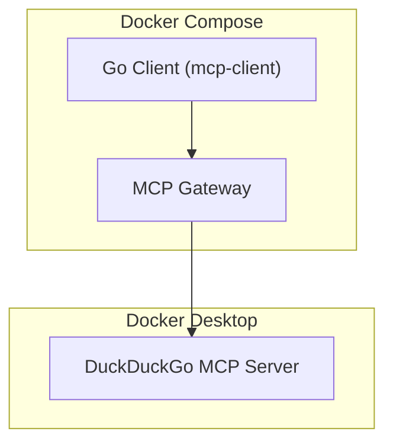

# MCP Toolkit and MCP Gateway

## Demo

This demo shows how to connect to Docker Desktop's MCP Toolkit through the MCP Gateway using Streamable HTTP transport. A Go client connects to the MCP Gateway (running on port 9011), which proxies access to MCP servers installed in Docker Desktop (like DuckDuckGo). The client initializes the connection, lists available tools from the MCP server, and displays them. The entire setup runs in Docker Compose with three services: the gateway, the client agent, and a cleanup service that stops the gateway when the client finishes.

## Architecture



## Prerequisites

Be sure to have some MCP servers installed and running in Docker Desktop. And Install the **DuckDuckGo** MCP server:


## Have a look to the `compose.yml` file

- The `mcp-gateway` service start the **Docker MCP Gateway** (and connect only on the `duckduckgo` server)
- The `mcp-client` is a Golang program that will connect to the gateway and query for a tool list.

## Start the demo

```bash
cd 01-mcp-toolkit-and-mcp-gateway
docker compose up --build --no-log-prefix
```

## Stop the demo

**Open another terminal**:
```bash
cd 01-mcp-toolkit-and-mcp-gateway
docker compose down
```

