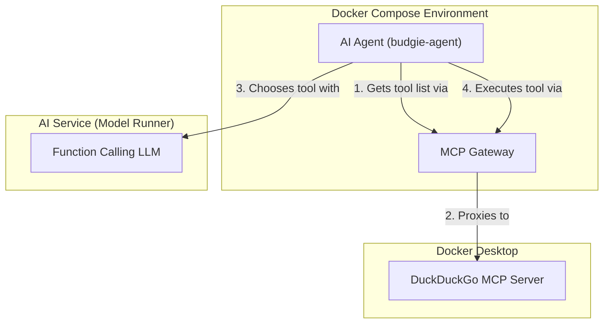

# MCP Toolkit, MCP Gateway and Function Calling

## Demo

This demo shows how to build an AI agent that uses function calling to interact with MCP servers through the Docker Desktop MCP Gateway. A Go-based AI agent connects to the MCP Gateway (running on port 9011), retrieves available tools from the DuckDuckGo MCP server, and uses an LLM with function calling capabilities to intelligently select and execute the appropriate tools based on user queries. The agent analyzes the user's request ("Search for good pizzerias in Lyon, France"), detects which tool to call, executes it through the MCP Gateway, and displays the results. The entire setup runs in Docker Compose with the gateway and AI agent services.

## Architecture



## Prerequisites

✋✋✋ Be sure to have the **DuckDuckGo** MCP server installed and running in Docker Desktop. 

## Have a look at the `compose.yml` file

- The `mcp-gateway` service starts the **Docker MCP Gateway** (and connects only to the `duckduckgo` server)
- The `budgie-agent` is a Golang program that:
  - Connects to the MCP Gateway
  - Retrieves available tools
  - Uses an LLM (Lucy model) with function calling to analyze the user message
  - Detects which tool to use based on the user's query
  - Executes the detected tool through the MCP Gateway
  - Displays the results

### Setup

The **system instruction** and **user message are** configured as environment variables in the compose file for easy customization.

```yaml
SYSTEM_INSTRUCTION: |
  Your job is to understand the user prompt and decide if you need to use tools to run external commands.
  Ignore all things not related to the usage of a tool
USER_MESSAGE: |
  Search for good pizzerias in Lyon, France.
```

## Start the demo

In a terminal:
```bash
cd 02-mcp-toolkit-mcp-gateway-with-ai-agent
docker compose up --build --no-log-prefix
```

## Stop the demo

In another terminal:
```bash
cd 02-mcp-toolkit-mcp-gateway-with-ai-agent
docker compose down
```
