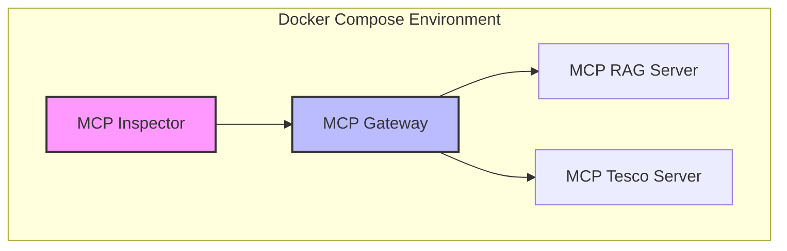

# Docker CE, MCP Gateway with `catalog.yaml` and 2 MCP Servers

## Demo

This demo showcases a more advanced use case of the **MCP Gateway**, where it uses a `catalog.yaml` file to discover and connect to multiple, independent MCP servers running as separate Docker containers. Instead of connecting to servers pre-installed in Docker Desktop, this example defines and runs its own MCP servers, demonstrating how to create a federated gateway for a custom ecosystem of tools.

The setup includes two distinct MCP servers:
1.  **A RAG (Retrieval-Augmented Generation) Server**: This server loads a collection of recipe documents and provides a tool to ask questions about them.
2.  **A Tesco Store Server**: This server provides tools to search for Tesco store locations by city or country.

The MCP Gateway exposes the tools from both servers through a single, unified endpoint, which can then be explored using the **MCP Inspector**.

## Architecture

The following diagram illustrates how the MCP Gateway acts as a single entry point for the two underlying MCP servers:



## Have a look at the `compose.yml` file

The `compose.yml` is the core of this setup. It defines the four main services: the gateway, the two MCP servers, and the inspector.

### MCP Gateway with Catalog

The `mcp-gateway` service is configured to use a `catalog` file. The `--servers` flag is used to specify which servers from the catalog should be activated. The catalog itself is defined inline using the `configs` directive in Docker Compose.

```yaml
services:
  mcp-gateway:
    image: docker/mcp-gateway:v2
    ports:
      - 9011:9011
    command:
      - --port=9011
      - --transport=streaming
      - --verbose
      - --catalog=/mcp/catalog.yaml
      - --servers=mcp-rag,mcp-tesco
    configs:
      - source: catalog.yaml
        target:
          /mcp/catalog.yaml
    ...

configs:
  catalog.yaml:
    content: |
      registry:
        mcp-rag:
          remote:
            url: "http://mcp-rag:6060/mcp"
            transport_type: http

        mcp-tesco:
          remote:
            url: "http://mcp-tesco:7070/mcp"
            transport_type: http
```

### The MCP Servers

Two custom Go-based MCP servers are included:

1.  **`mcp-rag`**: On startup, this service indexes all markdown files in its `data/` directory to create a vector store. It exposes one tool:
    *   `question_about_something(question: string)`: Finds and returns relevant text chunks from the recipe documents based on the user's question.

2.  **`mcp-tesco`**: This service loads store information from a JSON file. It exposes two tools:
    *   `get_stores_by_city(city: string)`: Returns a list of Tesco stores in a given city.
    *   `get_stores_by_country(country: string)`: Returns a list of Tesco stores in a given country.

### MCP Inspector

The `mcp-inspector` service is included to provide a web UI to connect to the gateway and visualize the combined toolset from both servers. After starting the services, you can access it at `http://localhost:6274`.

## Start the demo

```bash
cd 03-docker-ce-mcp-gateway-with-catalog
docker compose up --build --no-log-prefix
```

Once the services are running, open your web browser and navigate to the **MCP Inspector** at [http://localhost:6274](http://localhost:6274).

Use the following settings to connect to the gateway:
- **Transport Type**: `Streamable HTTP`
- **URL**: `http://mcp-gateway:9011/mcp`
- **Connection Type**: `Via Proxy`

You should see the tools from both the RAG server and the Tesco server listed together.

## Stop the demo

```bash
cd 03-docker-ce-mcp-gateway-with-catalog
docker compose down
```